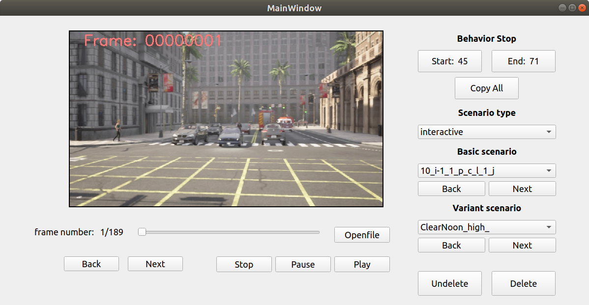
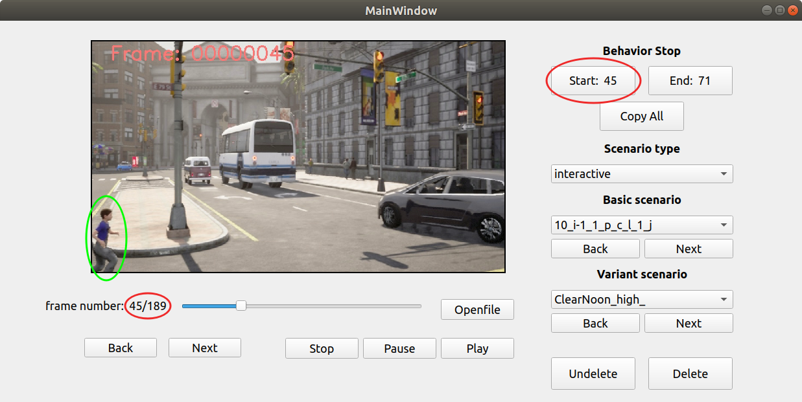
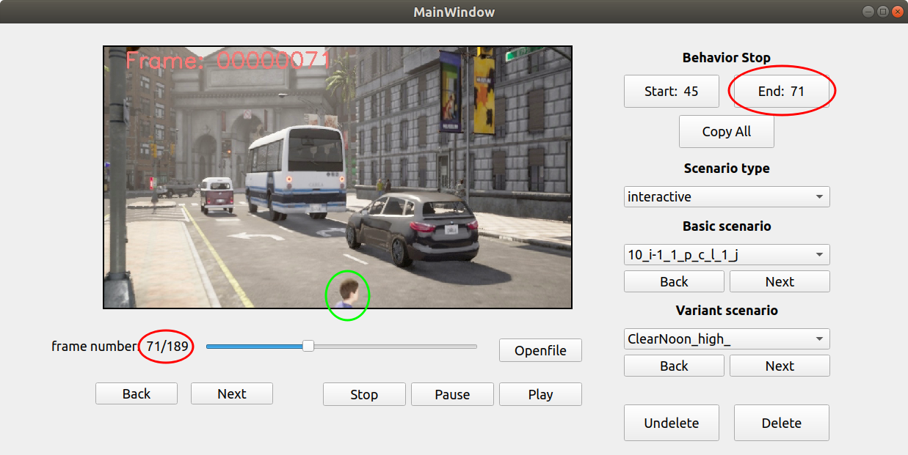
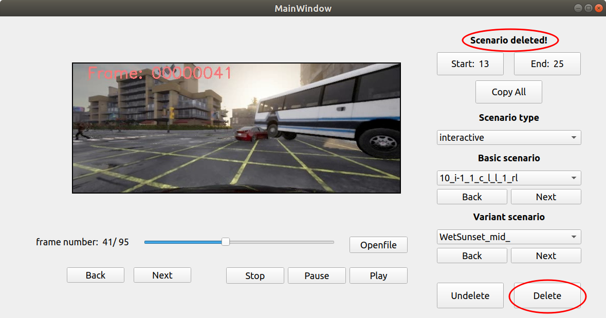

# Setup

1. Navigate to `vis_tools_behavior`
2. Create the environment
	```bash
	conda create -n label python=3.7
	conda activate label

	# Install necessary packages
	conda  install pyqt
	pip install opencv-python-headless
	pip install scipy
	```

# Ego’s Behavior Annotation
* Run the following command:
	```
	python start.py
	```
	

* Example Steps:
   1. Click **start** when the actor begins interacting with ego (you)
   
   
   2. Click **End** when the actor finishes interacting with ego
   
   
   3. Click **Copy All** to copy `start` and `end` frame numbers to the all **variant** in the current **basic** scenario.
   Then, manually review all the variant scenarios.
   
   4. **Delete** the scenario if any risky object is not the interactor or unexpected event occurs. 
   Click **Undelete** undo the deletion
   
   
   5. Note: 
      * Behavior **start** and **end** are automatically saved.
      * The interactor (risky object) needs to appear throughout the entire frame interval **[start, end]**
